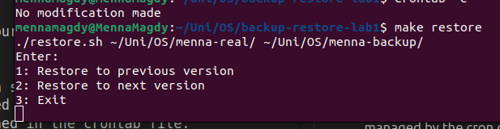
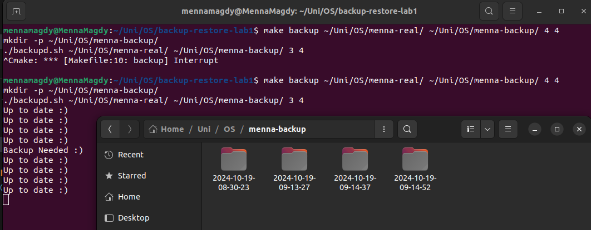
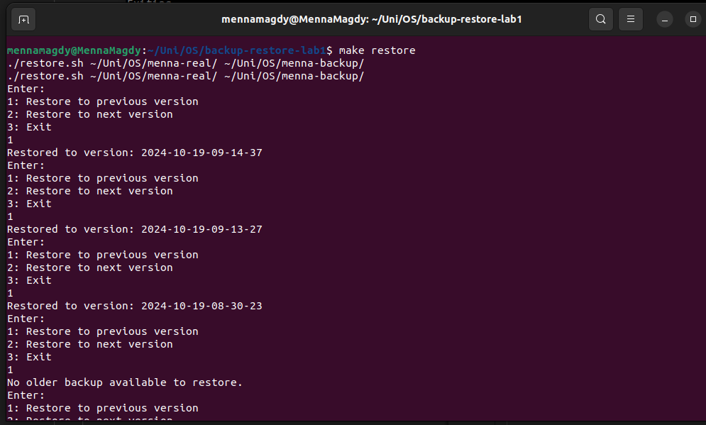

# OS : Lab 1 Assignment

## Overview
A backup and restore system implemented using bash scripts, allowing user to create up to n backups from a specified directory at x intervals of time, and restore the directory to any of the saved backups

#### Hierarchy:

directory: backup-restore-lab1
- backupd.sh
- restore.sh
- Makefile
- backup-cron.sh

## Prerequisites
Ensure that you have make installed using:
```bash
make --version
```
If not, you can install it by running the following commands:
```bash
sudo apt update
sudo apt install make
```

## User Guide

### Part 1: Backup a directory
To activate the backup script:
1. Make sure you're in the directory where the backupd.sh file exists
2. run:
```bash
make backup SRC_DIR=<source_dir> BACKUP_DIR=<backup_dir>
```
You can also specify the interval, and maximum backups you desire by adding:
```bash
INTERVAL=3 MAX_BACKUPS=4
```
Note that they're 3 and 4 respectively by default

----------------------


### Part 2: Restoring directory from a backup
To activate the restore script:
1. Make sure you're in the directory where the restore.sh file exists
2. Run:
```bash
make restore SRC_DIR=<source_dir> BACKUP_DIR=<backup_dir>
```
Note that your backup directory should be the output of the previously mentioned backup script for this script to work, as it depends on comparing timestamps of versions.

To move between the n saved backups from your directory, you'll be asked to enter one of the following


-------------------------------

### Bonus | Part 4: Cron Job

"Automating backing up your directory every minute."
----------

#### What is a cron job?
A cron job in Ubuntu is a scheduled task that runs automatically at specified intervals. It’s managed by the cron daemon and defined in the crontab file.

In this part, cron is used to schedule running the backup script in the background every minute.

#### Setting up a cron job
1. To modify the crontab run the following:
```bash
crontab -e
```
2. Add the following configuration to the crontab
```bash
*/1 * * * * /path/to/backup-cron.sh-script /src/directory /backup/directory /number/of/max-backups/
```
Make sure you enter the configuration correctly

3. Ctrl+O to save the configuration, Ctrl+X the exit the crontab

4. To verify that the cron job is working:
```bash
crontab -l
```

-----------------------
### Sample Run

1. Backup Script:


2. Restore Script:


----------------------

### Resources:

1. Bash Script

- [Shell Script Commands](https://www.freecodecamp.org/news/bash-scripting-tutorial-linux-shell-script-and-command-line-for-beginners/)

- [Bash Script Basics](https://www.howtogeek.com/439199/15-special-characters-you-need-to-know-for-bash/)

2. Makefiles

- [Makefiles : How to](https://www.gnu.org/software/make/manual/html_node/)

3. Cron jobs

- [Cron jobs in Linux](https://www.freecodecamp.org/news/cron-jobs-in-linux)
- [Setting up cron jobs in Ubuntu](https://www.geeksforgeeks.org/how-to-setup-cron-jobs-in-ubuntu/)


